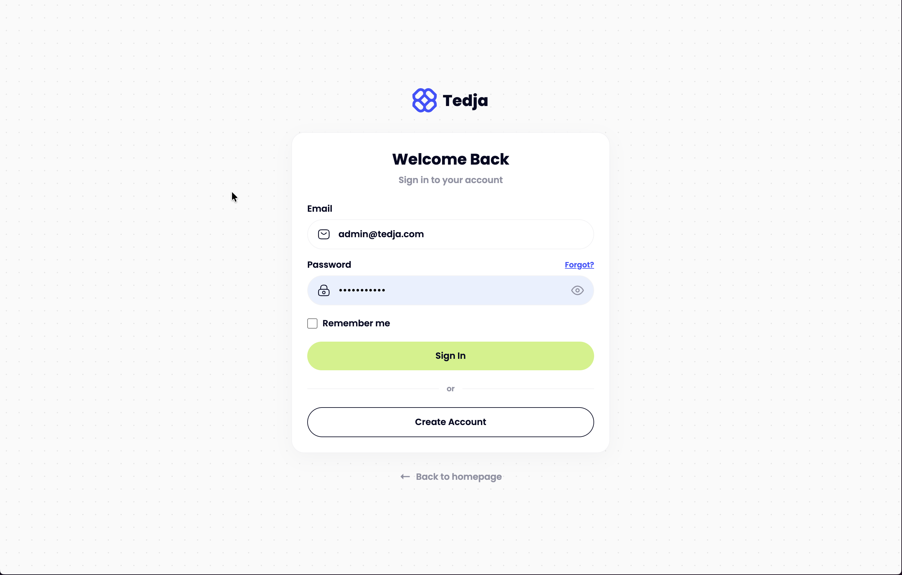
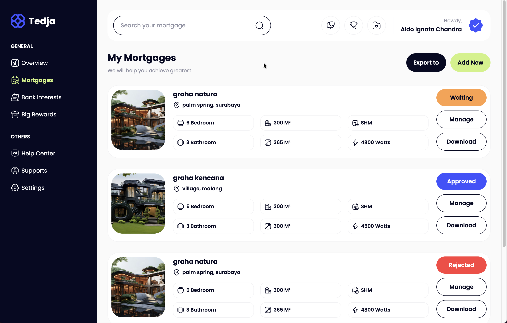
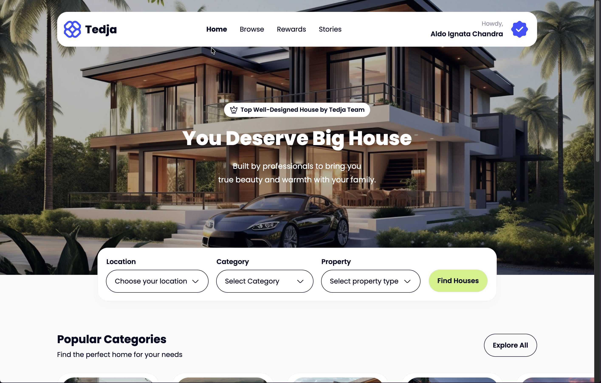
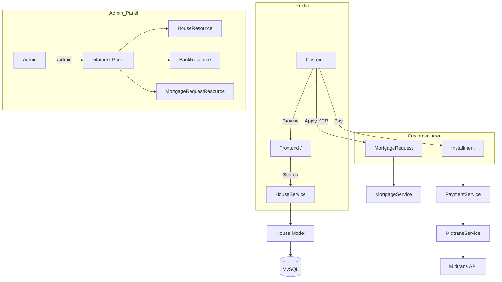
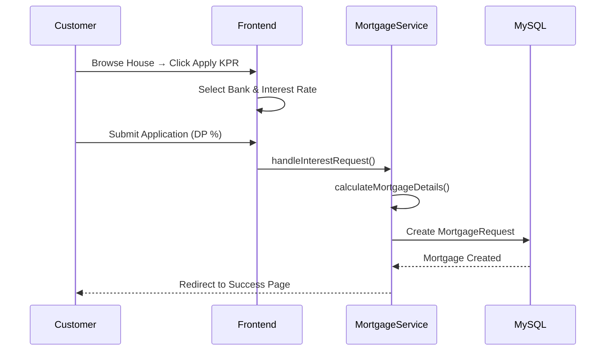
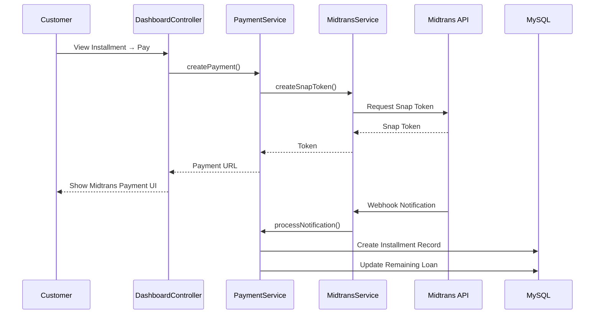

# 🏠 Tedja - Laravel Property & KPR Mortgage Platform


Full-featured **property listing & KPR mortgage platform** built with **Laravel 12 + Filament 3.3**. This application allows users to browse houses, request mortgages with bank interest rates, and manage installment payments via Midtrans payment gateway.

Designed for the Indonesian property market (IDR currency, Jakarta timezone), Tedja features a complete admin dashboard and customer-facing frontend with role-based access control.

> 🎓 **Learning Project**: This is an experimental project built while learning fullstack Laravel development. The codebase is functional but still evolving — expect future updates and improvements as I continue learning!

---

## 📸 Overview

### Overview - User Login Page



### Overview - User Mortgage Page



### Overview - Front Page Dashboard



---

## 🙏 Credits

This project was made possible thanks to the amazing course from **[BuildWithAngga](https://buildwithangga.com)** — an Indonesian coding tutorial platform that provides high-quality, practical programming courses. The tutorial provided the foundation and guidance for building this property & mortgage management system.

If you're looking to learn web development with real-world projects, check out their courses at [buildwithangga.com](https://buildwithangga.com)!

---

## 📚 Table of Contents

- [Features](#-features)
- [System Architecture](#-system-architecture)
- [Project Structure](#-project-structure)
- [Prerequisites](#-prerequisites)
- [Getting Started](#-getting-started)
    - [1. Clone & Install](#1-clone--install)
    - [2. Environment Configuration](#2-environment-configuration)
    - [3. Database Setup](#3-database-setup)
    - [4. Run Application](#4-run-application)
- [Available Scripts](#-available-scripts)
- [Application Flow](#-application-flow)
- [Architecture Patterns](#-architecture-patterns)
- [Testing](#-testing)
- [Troubleshooting](#-troubleshooting)
- [Credits](#-credits)

---

## ✨ Features

- **Property Management** - Browse houses by category, city with detailed filtering
- **KPR Mortgage System** - Request mortgages with multiple bank interest rate options
- **Amortization Calculations** - Automatic monthly payment calculations with principal + interest breakdown
- **Midtrans Payment Gateway** - Secure online installment payments with webhook notifications
- **Filament Admin Panel** - Full CRUD management for houses, banks, categories, mortgage requests
- **Role-Based Access Control** - Admin, Customer roles using Spatie Permissions
- **Customer Dashboard** - View mortgages, track installments, make payments
- **Responsive Frontend** - Tailwind CSS with custom design system
- **Soft Deletes** - Data safety with soft delete on all models
- **Laravel Breeze Authentication** - Login, register, password reset, email verification
- **Custom Error Pages** - Beautiful 403, 404, 500 error pages matching brand design
- **Custom Admin Login** - Styled Filament login page matching frontend design

---

## 🏗 System Architecture

### High-Level Application Flow



### Mortgage Request Flow



### Payment Flow (Midtrans)



---

## 📁 Project Structure

```
tedja-project/
├── app/
│   ├── Filament/
│   │   └── Resources/              # Admin panel resources
│   │       ├── BankResource.php
│   │       ├── CategoryResource.php
│   │       ├── CityResource.php
│   │       ├── FacilityResource.php
│   │       ├── HouseResource.php
│   │       ├── InterestResource.php
│   │       ├── MortgageRequestResource/
│   │       ├── RoleResource.php
│   │       └── UserResource.php
│   ├── Http/
│   │   ├── Controllers/
│   │   │   ├── FrontController.php       # Public pages
│   │   │   ├── DashboardController.php   # Customer dashboard
│   │   │   ├── ProfileController.php
│   │   │   └── Auth/                     # Breeze auth controllers
│   │   └── Requests/                     # Form requests
│   ├── Models/
│   │   ├── User.php
│   │   ├── House.php
│   │   ├── Category.php
│   │   ├── City.php
│   │   ├── Bank.php
│   │   ├── Interest.php
│   │   ├── Facility.php
│   │   ├── HouseFacility.php
│   │   ├── HousePhoto.php
│   │   ├── MortgageRequest.php
│   │   └── Installment.php
│   ├── Services/
│   │   ├── HouseService.php        # Property search & details
│   │   ├── MortgageService.php     # Mortgage calculations
│   │   ├── PaymentService.php      # Payment orchestration
│   │   └── MidtransService.php     # Midtrans integration
│   └── Providers/
│       └── Filament/
│           └── AdminPanelProvider.php
├── config/
│   ├── midtrans.php                # Midtrans configuration
│   └── permission.php              # Spatie permissions
├── database/
│   ├── migrations/                 # 15 migration files
│   └── seeders/
│       └── RoleAdminSeeder.php     # Default roles + admin user
├── resources/
│   ├── views/
│   │   ├── front/                  # Public pages
│   │   │   ├── index.blade.php
│   │   │   ├── category.blade.php
│   │   │   ├── details.blade.php
│   │   │   └── search.blade.php
│   │   ├── customer/               # Customer dashboard
│   │   │   ├── mortgages/
│   │   │   │   ├── index.blade.php
│   │   │   │   ├── details.blade.php
│   │   │   │   ├── request_mortgage.blade.php
│   │   │   │   └── request_success.blade.php
│   │   │   └── installments/
│   │   │       ├── details.blade.php
│   │   │       └── pay_installment.blade.php
│   │   ├── layouts/                # Master, App, Guest layouts
│   │   └── components/             # Blade components
│   └── css/
│       └── app.css                 # Tailwind entry
├── routes/
│   └── web.php                     # All route definitions
├── tests/                          # Feature & Unit tests
├── .env.example                    # Environment template
├── composer.json                   # PHP dependencies
├── package.json                    # Node dependencies
├── phpunit.xml                     # Test configuration
└── tailwind.config.js              # Tailwind configuration
```

---

## ✅ Prerequisites

Before you begin, ensure you have the following installed:

1. **PHP** (8.2 or later, **8.4 recommended**) with extensions:
    - `pdo_mysql`, `mbstring`, `openssl`, `json`, `fileinfo`

    > 💡 **Note**: While PHP 8.2 is the minimum requirement, we recommend using **PHP 8.4** for better performance and latest language features.

2. **Composer** (PHP package manager)

    ```bash
    curl -sS https://getcomposer.org/installer | php
    mv composer.phar /usr/local/bin/composer
    ```

3. **MySQL** (8.0 or later) or MariaDB

4. **Node.js** (18+ or 20+) and **NPM**

5. **Git**

---

## 🚀 Getting Started

Follow these steps strictly to get the application running locally.

### 1. Clone & Install

```bash
git clone <your-repo-url>
cd tedja-project

# Install PHP dependencies
composer install

# Install Node.js dependencies
npm install
```

### 2. Environment Configuration

Copy the example environment file and configure it:

```bash
cp .env.example .env

# Generate application key
php artisan key:generate
```

**Critical Variables Explained:**

| Variable                 | Description         | Default (Local)           |
| ------------------------ | ------------------- | ------------------------- |
| `APP_NAME`               | Application name    | `Tedja`                   |
| `APP_URL`                | Base URL            | `http://localhost:8000`   |
| `DB_CONNECTION`          | Database driver     | `mysql`                   |
| `DB_HOST`                | Database host       | `127.0.0.1`               |
| `DB_DATABASE`            | Database name       | `db_tedja_project`        |
| `DB_USERNAME`            | Database user       | `root`                    |
| `DB_PASSWORD`            | Database password   | (empty)                   |
| `MIDTRANS_SERVER_KEY`    | Midtrans server key | (from Midtrans dashboard) |
| `MIDTRANS_CLIENT_KEY`    | Midtrans client key | (from Midtrans dashboard) |
| `MIDTRANS_IS_PRODUCTION` | Production mode     | `false`                   |

### 3. Database Setup

**Create the database:**

```bash
# Via MySQL CLI
mysql -u root -p -e "CREATE DATABASE db_tedja_project;"
```

**Run migrations:**

```bash
php artisan migrate
```

**Seed the database (creates admin user and roles):**

```bash
php artisan db:seed --class=RoleAdminSeeder
```

Default admin credentials:

- Email: `admin@tedja.com`
- Password: `admin123`

### 4. Run Application

**Start the development server:**

```bash
# Terminal 1: Laravel dev server
php artisan serve

# Terminal 2: Vite dev server (for assets)
npm run dev
```

The application will be available at:

- **Frontend**: `http://localhost:8000`
- **Admin Panel**: `http://localhost:8000/admin`

**Build for production:**

```bash
npm run build
```

---

## 🧰 Available Scripts

| Script                                        | Description                                              |
| --------------------------------------------- | -------------------------------------------------------- |
| `composer install`                            | Install PHP dependencies                                 |
| `composer dev`                                | Run full dev environment (Laravel + Queue + Logs + Vite) |
| `composer format`                             | Run Laravel Pint (code style fixer)                      |
| `composer format:check`                       | Check code style without fixing                          |
| `composer test`                               | Run PHPUnit tests                                        |
| `npm install`                                 | Install Node.js dependencies                             |
| `npm run dev`                                 | Start Vite development server                            |
| `npm run build`                               | Build assets for production                              |
| `php artisan serve`                           | Start Laravel development server                         |
| `php artisan migrate`                         | Run database migrations                                  |
| `php artisan migrate:fresh --seed`            | Reset DB and seed                                        |
| `php artisan db:seed --class=RoleAdminSeeder` | Seed roles and admin                                     |
| `php artisan storage:link`                    | Create storage symlink                                   |
| `php artisan route:list`                      | List all routes                                          |
| `php artisan pail`                            | Monitor application logs                                 |

---

## 🔄 Application Flow

### Public Routes

| Route                  | Controller                 | Description                                |
| ---------------------- | -------------------------- | ------------------------------------------ |
| `GET /`                | `FrontController@index`    | Homepage with categories & featured houses |
| `GET /category/{slug}` | `FrontController@category` | Houses by category                         |
| `GET /details/{slug}`  | `FrontController@details`  | House detail page                          |
| `GET /search`          | `FrontController@search`   | Search houses by city/category             |

### Customer Routes (auth + role:customer)

| Route                                              | Controller                                   | Description               |
| -------------------------------------------------- | -------------------------------------------- | ------------------------- |
| `GET /request/mortgage/{interest}`                 | `FrontController@interest`                   | Mortgage application form |
| `POST /request/mortgage/submitted`                 | `FrontController@request_interest`           | Submit mortgage request   |
| `GET /request/success`                             | `FrontController@request_success`            | Success page              |
| `GET /dashboard/mortgages`                         | `DashboardController@index`                  | My mortgages list         |
| `GET /dashboard/mortgage/{id}`                     | `DashboardController@details`                | Mortgage detail           |
| `GET /dashboard/mortgage/installment/{id}`         | `DashboardController@installment_details`    | Installment details       |
| `GET /dashboard/mortgage/{id}/installment/payment` | `DashboardController@installment_payment`    | Payment form              |
| `POST /dashboard/mortgage/installment/payment`     | `DashboardController@payment_store_midtrans` | Process payment           |

### Webhook

| Route                                                   | Controller                                          | Description      |
| ------------------------------------------------------- | --------------------------------------------------- | ---------------- |
| `POST /mortgage/interest/payment/midtrans/notification` | `DashboardController@payment_midtrans_notification` | Midtrans webhook |

---

## 🏗️ Architecture Patterns

### Service Layer Pattern

Controllers are kept thin - business logic lives in Services:

```php
// Controller delegates to Service
class FrontController extends Controller
{
    public function __construct(
        private HouseService $houseService,
        private MortgageService $mortgageService
    ) {}

    public function index()
    {
        $data = $this->houseService->getCategoriesAndCities();
        return view('front.index', $data);
    }
}
```

### Repository-like Service Pattern

```php
// Service handles business logic
class HouseService
{
    public function searchHouses($filters)
    {
        return House::with(['category', 'city'])
            ->when($filters['city_id'], fn($q, $id) => $q->where('city_id', $id))
            ->when($filters['category_id'], fn($q, $id) => $q->where('category_id', $id))
            ->get();
    }
}
```

### Eager Loading (N+1 Prevention)

```php
// ✅ Good: Eager load relationships
$house = House::with(['category', 'city', 'photos', 'facilities.facility'])
    ->findOrFail($id);

// ❌ Bad: N+1 queries
$house = House::find($id);
echo $house->category->name; // Extra query!
```

---

## 🧪 Testing

Run the test suite:

```bash
# Run all tests
composer test

# Or directly with PHPUnit
php artisan test

# Run specific test file
php artisan test --filter=HouseTest

# Run with coverage
php artisan test --coverage
```

### Test Organization

```
tests/
├── Feature/          # HTTP/Integration tests
├── Unit/             # Unit tests
└── TestCase.php      # Base test class
```

---

## 🔧 Troubleshooting

| Issue                           | Possible Cause                        | Solution                                                                |
| ------------------------------- | ------------------------------------- | ----------------------------------------------------------------------- |
| **Database connection failed**  | MySQL not running / wrong credentials | Start MySQL and check `.env` DB\_\* variables                           |
| **Class not found**             | Autoload not updated                  | Run `composer dump-autoload`                                            |
| **Storage images not loading**  | Symlink not created                   | Run `php artisan storage:link`                                          |
| **419 Page Expired**            | CSRF token missing                    | Add `@csrf` to forms                                                    |
| **Filament panel 403**          | User doesn't have admin role          | Check user has `admin` role in database                                 |
| **Admin login not working**     | Corrupted password hash               | Reset password via Tinker: `$user->password = bcrypt('newpass')`        |
| **Livewire root element error** | Multiple root elements in Blade       | Ensure only ONE root element per component (wrap styles/scripts inside) |
| **Midtrans payment fails**      | Missing/wrong API keys                | Add correct keys to `.env`                                              |
| **Migration error**             | Schema mismatch                       | Run `php artisan migrate:fresh --seed` (⚠️ destroys data)               |
| **Permission denied**           | File permissions                      | Run `chmod -R 775 storage/`                                             |
| **CSS not loading**             | Vite not running                      | Run `npm run dev` in separate terminal                                  |
| **Blank page / 500 error**      | Check logs                            | Read `storage/logs/laravel.log`                                         |

### Debug Commands

```bash
# Check Laravel version
php artisan --version

# List all routes
php artisan route:list

# Check config in Tinker
php artisan tinker
>>> config('midtrans.server_key')

# Clear all caches
php artisan optimize:clear

# Check migration status
php artisan migrate:status

# Monitor logs in real-time
php artisan pail
```

---

## 🚀 Future Development

This project is actively being developed. The following features are planned for upcoming releases:

### 🎯 Planned Features

| Feature                     | Description                                                                                                                                                             | Priority |
| --------------------------- | ----------------------------------------------------------------------------------------------------------------------------------------------------------------------- | -------- |
| **Reward System**           | Point-based loyalty program for customers who make timely mortgage payments. Users can earn points redeemable for discounts, fee waivers, or property-related services. | High     |
| **Wishlist System**         | Allow customers to save favorite properties to a wishlist, receive price drop notifications, and compare multiple properties side-by-side.                              | High     |
| **Stories System**          | Property stories feature showcasing customer success stories, property highlights, market trends, and educational content about home ownership and mortgages.           | Medium   |
| **Responsive Design**       | Full mobile responsiveness optimization for all customer-facing pages including mortgage forms, payment flows, and dashboard on tablets and smartphones.                | High     |
| **Advanced Search Filters** | Enhanced property search with map-based filtering, price range sliders, and amenity checkboxes.                                                                         | Medium   |
| **Unit Testing**            | Comprehensive unit tests for Services, Controllers, and Models using PHPUnit. Aim for 80%+ code coverage.                                                               | High     |
| **Integration Testing**     | End-to-end feature tests for critical user flows: mortgage application, payment processing, and admin CRUD operations.                                                  | High     |

### 📝 Notes for Contributors

- **Reward System**: Consider implementing with Spatie's Laravel Activity Logger for tracking user actions
- **Wishlist**: Simple pivot table between `users` and `houses` with soft deletes
- **Stories**: Could use Filament's RichEditor for content management and store in a new `stories` table
- **Responsive Design**: Use Tailwind's responsive prefixes (`md:`, `lg:`) and test on actual devices. Focus on touch-friendly inputs and readable text sizes
- **Unit Testing**: Follow TDD approach - write failing tests first, then implement. Mock external services (Midtrans) for isolated tests
- **Integration Testing**: Use Laravel's HTTP tests with database transactions. Test complete flows from controller through service to database

Stay tuned for updates! Contributions and feature suggestions are welcome.

---

## 📄 License

This project is licensed under the MIT License.

---

Built for learning Laravel & PHP through practical property marketplace development with **Laravel 12 + Filament 3.3**.
